# How to use git and deploy code with VSTS

## Install Git
The most inportant part of using Git is the have it on your local machine. 
If you are a Windows user I suggest you to use *GitBash*. You can find the download link here: [link](https://git-scm.com/downloads)

If you are a Linux user you most likely have git on your machine. 

If you are a Mac person you most likely have it, but if not please visit this site: [link](https://git-scm.com/downloads)


## Clone this repository
**What does 'clone' mean?**

Clone is a synonym of 'download this repo on my local computer'. 

To clone this repo please click on Clone button on the top right corner. 

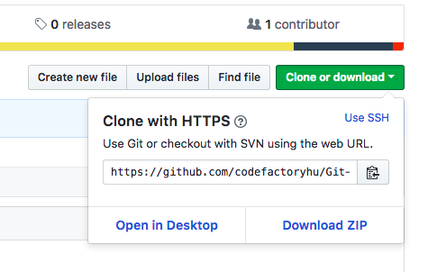

You will see your project url. Copy that url, then open up a terminal / GitBash window, and type the followings:
Navigate to a folder where you want to download the project to.

`cd /path/to/your/work/dir/`

And clone our repository

`git clone https://github.com/codefactoryhu/MS-Workshop-1-Git-VSTS-CI.git` 

Check if the project is downloaded or not:
`ls -la` or `dir`
You have to have something like this:
```sh
drwxr-xr-x   6 abo  staff  192 Máj 21 15:15 .
drwxr-xr-x  24 abo  staff  768 Máj 17 17:56 ..
drwxr-xr-x  12 abo  staff  384 Máj 21 15:37 .git
-rw-r--r--   1 abo  staff  134 Máj 17 18:42 .gitignore
-rw-r--r--   1 abo  staff  862 Máj 21 15:30 README.md
drwxr-xr-x  19 abo  staff  608 Máj 21 14:15 app
```

We have a nice README file, which you are reading right now. We have a .git folder, which contain all git related files, and configs, a .gitignore file, which contains a lot of exceptions we don't want to store in git, and an app folder, which contains our app. 

To make our life easier delete *.git* folder. 

`rm -rf ./.git`

And let's initialize a new git repo.

`git init`

## Git add, commit
We like what we did before, right? So it's time to save it into our repo. To add the changes to the local repo you have to type: 

`git add --all` or `git add file_name` if you want to add a file only

To commint our changes, we have to type the following: 

`git commit -m 'initial commit'`

This command will create a new commit (new version) of our app. 

## Open up Visual Studio Team Services
VSTS website: [link](https://www.visualstudio.com/team-services/)

If you have a Microsoft account you can sign in with it. If you don't, please register an account. 

## Create a new project
On the VSTS dashboard click on New Project button.


Name your project whatever you want. We named it Git-VSTS-CI.
Select 'or push an existing repository from command line'

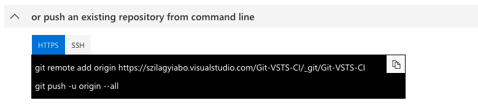

## Define remote, and push our project
Let's copy the first line in the screen.

`git remote add origin YOUR_REPO_URL`

This command will define our 'origin' remote repo.

Next step is to upload this new commit to the remote repo.

`git push origin master` 

Origin is the name of the remote repo (origin by default), master is the name of the branch we want to update.

## Creating a new branch
**What does a 'branch' mean?**

When you are using git you can have separate lanes of feature development. For example: I am creating a feature which is a design change, and my co-worker have a brand new feature under development. We can do this separatly useing branches.

To create a new local branch type the following:

`git checkout -b feature_change_image`

With this command we can create a new branch called 'feature_change_image'. This will be a separate lane from _master_ branch, which is our main branch (and most of the time it is).

## Let's modift something
Now we can modify something in our code.
For example we can change the logo of our app. Open up the project (or just the app/src/App.vue) file in your favorite text editor. I will use Visual Studio Code. 
Let's edit the 3 line, and change the value of the _src_ tag to something else. E.g.:
```html 
<template>
  <div id="app">
    
    <router-view/>
  </div>
</template>
```
Save the file, and check git status!

## Git status
To check what changes we made after our last commit type the following command: 

`git status -s` 

This command will show us where we made changes. You will see something like this:
```
M app/src/App.vue
```
If you want to have more details about the changes you can type: 

`git diff`

This will highlight you the lines changed.

## Push up our new branch
We have to add the changes to the local repo, and we have to make a new commit, which we will upload.

`git add --all` or `git add file_name`

`git commit -m 'fancy changes'`

To push up a new branch we have to do the following:

`git push origin feature_change_image` 

It is very similar to the push command we used earlier. 

## Create a new Azure App Service
Open up the [Azure Portal](https://portal.azure.com/)

Log in with your microsoft account.

Search for 'App Service' in the search bar.

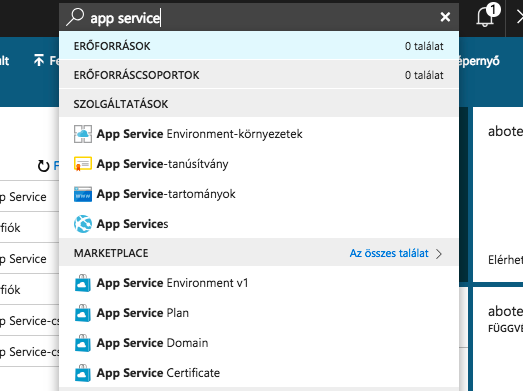

Hit '+ Hozzáad' to create new new App Service. 

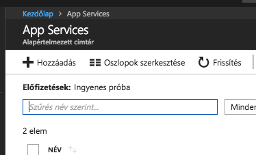

Select 'Webes alkalmazás'

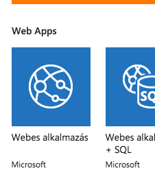

Click on 'Létrehozás'
Give it a name. 
Select a resoure group.
Select Windows for platform.
I recommend pin it to Dashboard. 

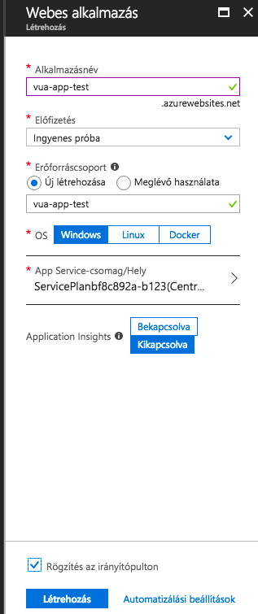

We have to wait a couple of minutes to launch. 

You can now visit your new website by clicking to 'Tallózás'

## Create a new CI/CD flow with continuous integration enabled
Open up your VSTS repo, click 'Builds and Release' and create a new CI flow.

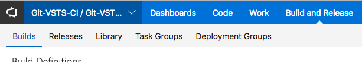

Select the current VSTS git repo as a source.

We can now start from an empty process.

Select Phase 1 and select 'Hosted Linux Preview' as our Agent queue. Now we can add new build steps by clicking '+' by Phase 1. 

**Task 1**

As far as this is a Vue.js project we have to use npm as our dependency manager, and build tool. First search for 'npm' in the search bar and select the 'npm' task.

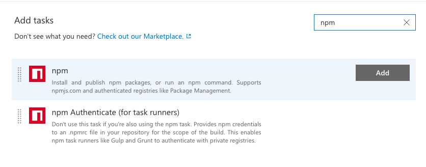

Now we can configuarate our task. First thing first, we have to install dependencies. Select install as a command (this is the default), and as our working folder type 'app'.

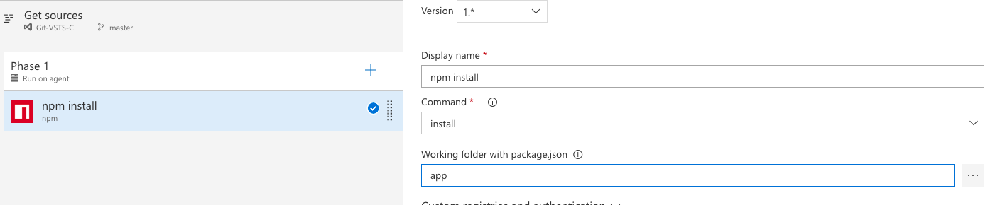

**Task 2**

Add a new task to Phase 1. Select 'npm' again. Name this 'npm run build'. The command will be **custom**, working directory is 'app' again, and the running command have to be **run build**. 

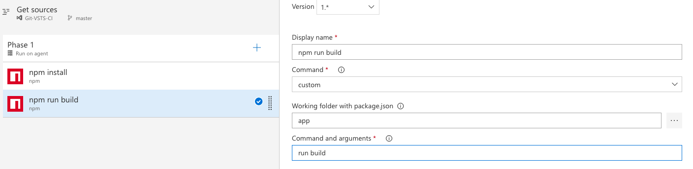

**Task 3**

Next task will be an 'Archive' task, where we zip our built folder. Add new task and search for 'archive'. Select the first one.

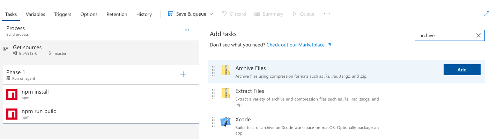

Display name can be anything, I name this 'Archive ./app/dist'. Root folder should be **./app/dist/**, archive type should be **zip**, archive file have to be **dist.zip**.

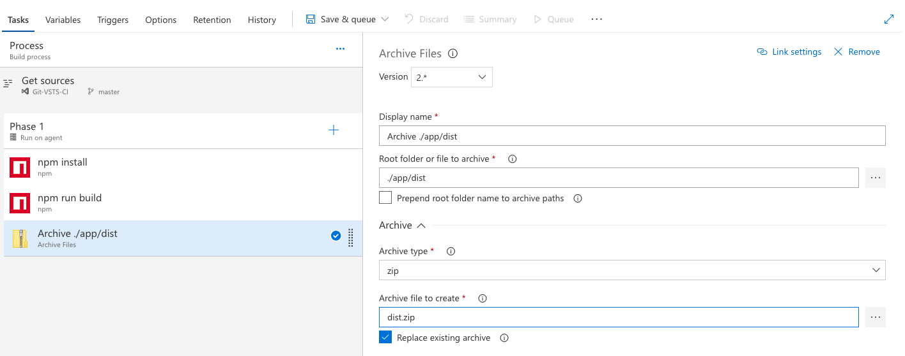

**Task 4**

Add new task and search for 'Azure CLI'. This will deploy our app to Azure Web apps. 

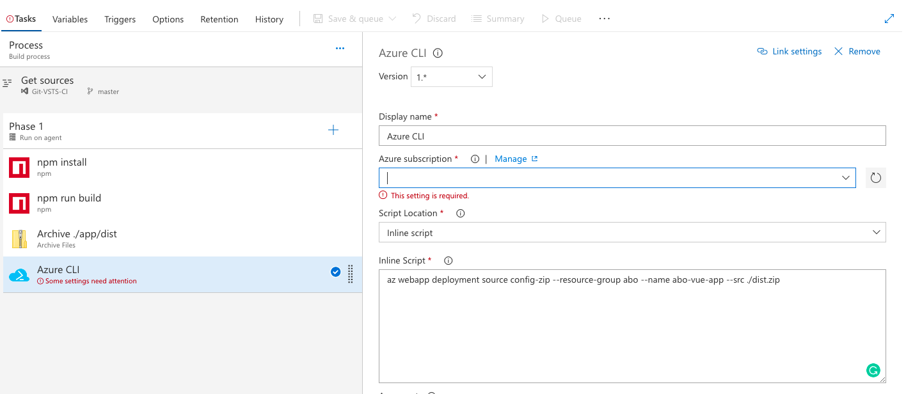

*Most important:* You have to select your Azure subscription, then Authorize it. This step will provide a new service principal to this VSTS build (this will be used during the login/authentication). Script location should be **Inline script**, the script will look like this:

`az webapp deployment source config-zip --resource-group RESOURCE_GROUPE --name APP_NAME --src ./dist.zip`

**Set trigger**

If we want to enable continuous deployment, we have to set it by clicking the Triggers tab.

Select 'Enable continuous integration', set include to master.

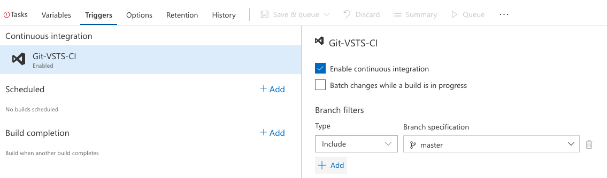

**Save Flow & run it**
Now we can save this new CD flow. Select 'Save & Queue' from the top menu.

Click the name of the build, let's see whether it is working or not. 

## Create a new pull request
We have already push-ed our fancy changes before. So it is time to merge it the the *master* branch.

Fist click on 'Code', and select 'Pull requests'

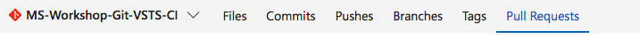

Than create a new pull request.

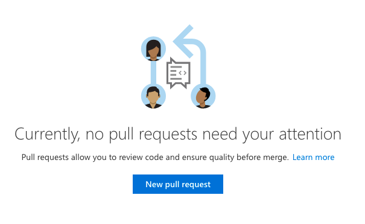

Source branch shoud be 'feature_change_image', the target branch should be 'master'.
Now you can edit the name of the pull request, and the description. You can see the diff between the branches down below. 

Click on 'Create' button. 

On the next page, we can see a summary, with lots of options. To accept a pull request, someone from your team have to approve the changes. As soon as I am a one-man team, I will accept my changes. :) Than I can 'Complete' the pull request. 

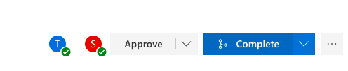

Now we can check the 'Build and Release' menu, and see how our CD flow works. ;) 

## Voila

Let's see the latest version of our site.

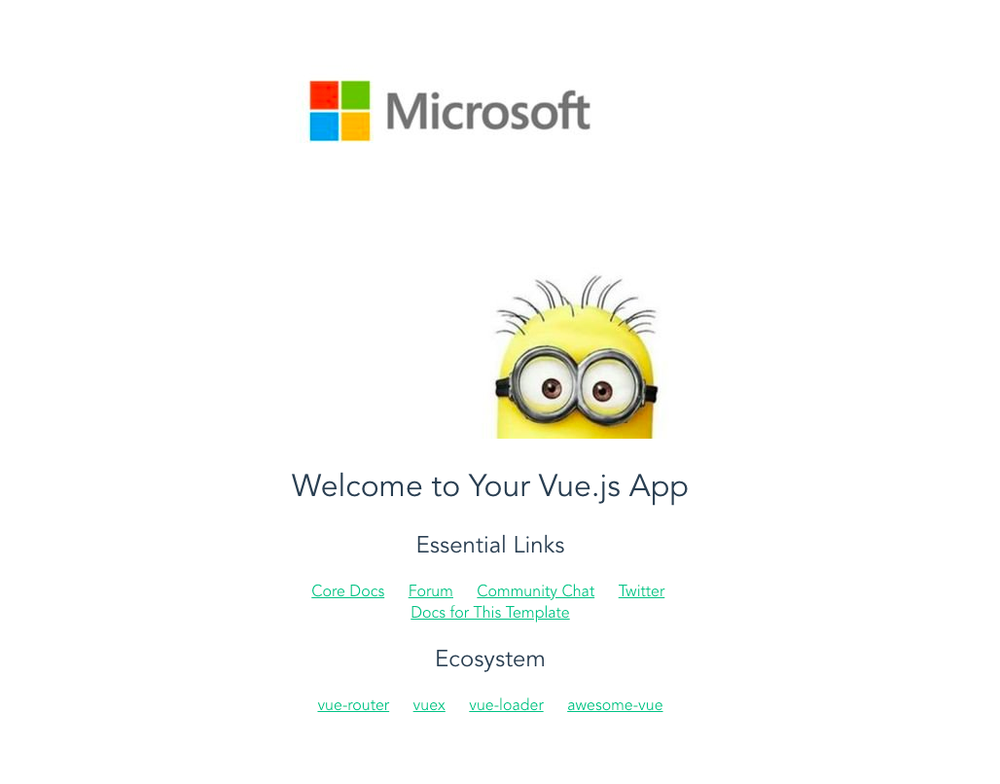

## Local testing
To test locally you either have to have node + npm installed on your machine, or Docker installed on your machine.

**Testing *without* docker:**
* `cd /path/to/project/app`
* `npm install`
* `npm run dev`
* navigate browser to localhost:8080

**Testing *with* docker:**
* ``docker run --rm -it -p 8080:8080 -v `pwd`:/srv/ node:8.11.2-alpine /bin/sh``
* `cd /srv/app/`
* `npm install`
* `export HOST=0.0.0.0`
* `npm run dev`
* navigate browser to localhost:8080

## Credits & disclaimer

This repo is a part of a workshop hosted by Microsoft Hungary. The event is helt by, and all credit goes to Nextent Informatics and Code Factory. 
